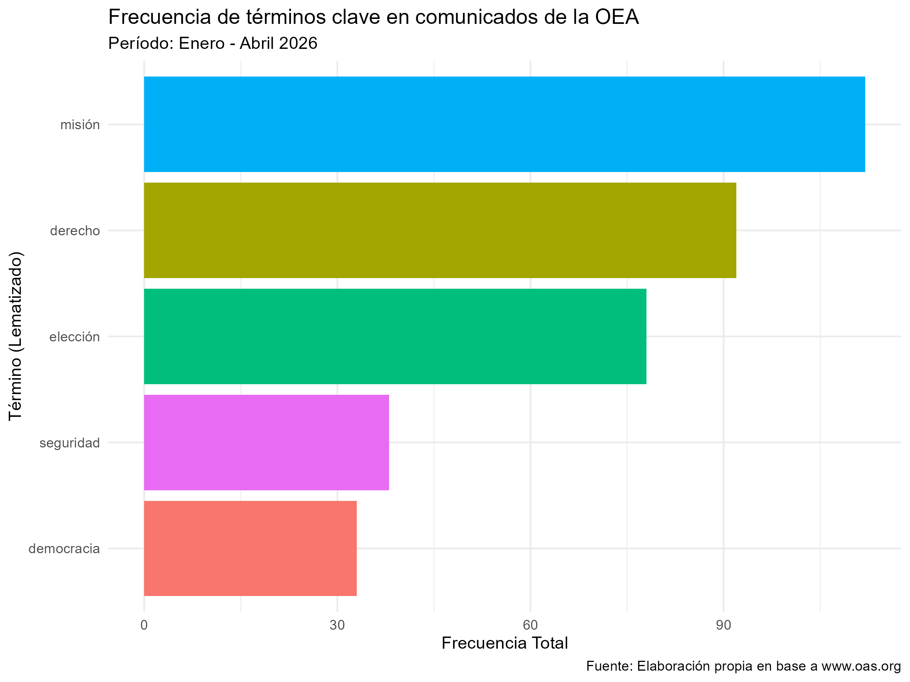

```{r setup, include=FALSE}
# Cargo las librerías básicas para que el notebook funcione
library(tidyverse)
library(here)
library(knitr)
```

## ¿Qué quise investigar? 
Para este trabajo me interesó ver de qué habla la OEA cuando saca comunicados oficiales. Mi pregunta fue: ¿Cuáles son los temas que más le preocupan a la organización hoy en día? Quería ver si realmente se enfocan tanto en la "democracia" y las "misiones" como uno cree, o si aparecen otros temas más fuertes.

## ¿Cómo armé el proyecto? 
Organicé todo en tres partes para que sea más prolijo. Acá abajo está el código que hace correr mis scripts en orden:

```{r, message=TRUE}
#| message: false
#| warning: false
#| results: 'hide'
library(here)
# Ejecuto los scripts, pero ocultamos los mensajes de descarga
source(here("TP2", "scripts", "scraping_oea.R"))
source(here("TP2", "scripts", "processing.R"))
source(here("TP2", "scripts", "metrics_figures.R"))
```

## 1.  El Scraping 

Primero hice un script para entrar a la web de la OEA. Lo que hice fue armar un bucle que recorre los meses de 2026 y se baja todos los comunicados. Los guardé como archivos HTML en una carpeta data para no tener que pedirlos a la web cada vez que quería probar algo.

## 2.  La Limpieza (NLP)

Después de tener los textos, me puse a limpiar. Usé udpipe para lematizar (o sea, llevar las palabras a su raíz) y me quedé solo con los sustantivos, verbos y adjetivos, porque las preposiciones y conectores no me servían para el análisis. También saqué las "stopwords" usando la lista de la clase.

## 3.  Las Métricas 

Por último, armé una matriz (DTM) para contar cuántas veces aparecían algunas palabras clave que elegí y armé el gráfico que muestro más abajo.

## Interpretación de los resultados Acá está la figura que salió del análisis:

::: {#fig-frecuencias}
{width=100%}
:::

Mirando el gráfico, me di cuenta de que la palabra "misión" y "derecho" aparecen un montón. Esto tiene sentido porque la OEA se la pasa mandando misiones de observación electoral y hablando de derechos humanos. Lo que me llamó la atención es que "democracia" está ahí arriba pero no es la número uno; parece que la organización es más "operativa" (misiones) que teórica.

En conclusión, el proceso me sirvió para automatizar algo que a mano me hubiera llevado días, y ahora puedo ver clarito de qué trata la agenda de la OEA este año.
